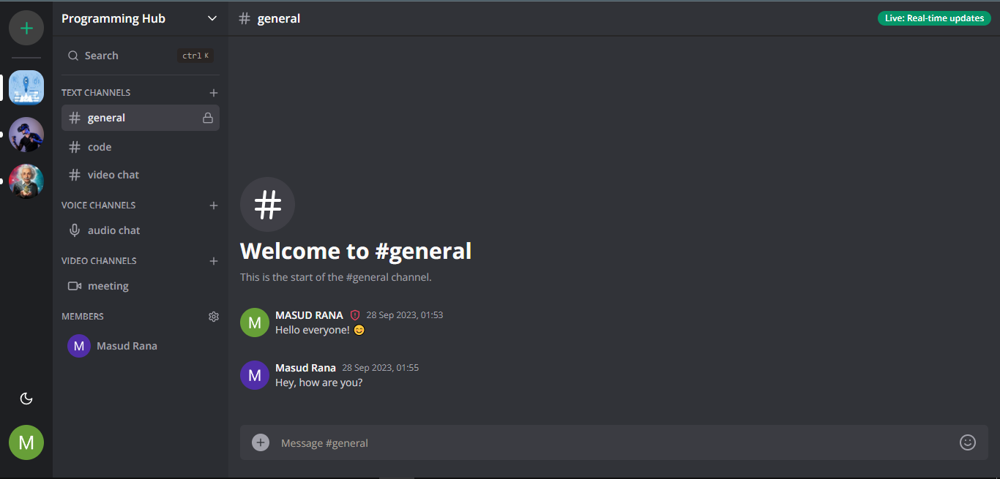
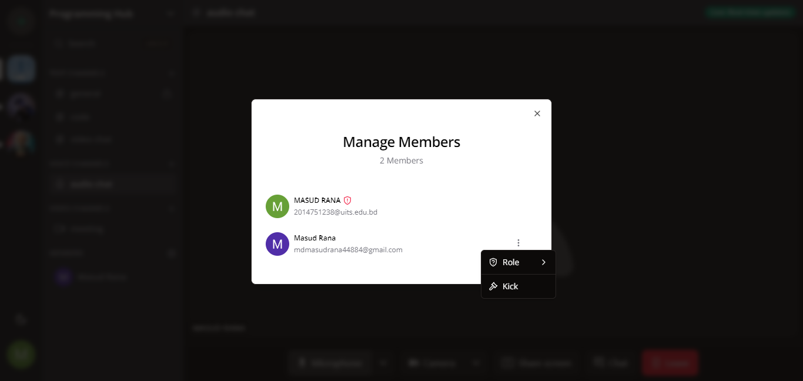
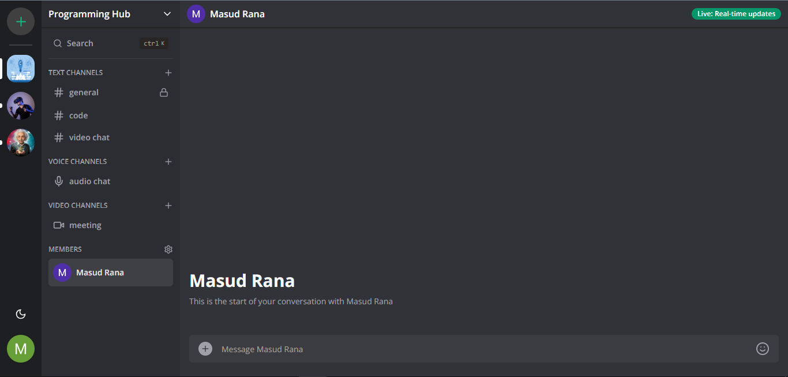

<h1 align="center">
Team Chat Application with Next.js 13, React.js, Socket.io, Tailwind, Prisma, PostgresSQL</h1>

<p align="center"></p>

<p>This is a team chat application. Here user can create, manage groups with text, audio and video channel supports. This application is build with Next.js 13, React.js, Socket.io, Tailwind, Prisma, PostgresSQL and many more technologies.</p>

## 📝 Features

- Real-time messaging using Socket.io
- Send attachments as messages using UploadThing
- Text, Audio and Video channels support
- Authentication with Clerk
- Member management (Kick, Role change Guest/Moderator)
- Delete & Edit messages in real time for all users
- Full working invite system (Unique invite like generation)
- Infinite loading for messages in batches of 10(tanstack/query)
- Light/Dark mode
- Full responsivity and mobile UI
- ORM using Prisma

## 🚀 Live Demo

[https://discord-clone-production-8657.up.railway.app/](https://discord-clone-production-8657.up.railway.app/)

## 🛠️ Installation Steps:

<p>1. Clone the repository</p>

```
git clone https://github.com/masud-rana44/discord-clone.git
```

<p>2. Install dependencies </p>

```
npm install
```

<p>3. Setup .env file </p>

```
NEXT_PUBLIC_CLERK_PUBLISHABLE_KEY=
CLERK_SECRET_KEY=
NEXT_PUBLIC_CLERK_SIGN_IN_URL=
NEXT_PUBLIC_CLERK_SIGN_UP_URL=
NEXT_PUBLIC_CLERK_AFTER_SIGN_IN_URL=
NEXT_PUBLIC_CLERK_AFTER_SIGN_UP_URL=


DATABASE_URL=

UPLOADTHING_SECRET=
UPLOADTHING_APP_ID=

LIVEKIT_API_KEY=
LIVEKIT_API_SECRET=
NEXT_PUBLIC_LIVEKIT_URL=
```

<p>4. Setup Prisma </p>

```
npx prisma generate
npx prisma db push
```

<p>5. Start the app</p>

```
npm run dev
```

### screenshots




## 💻 Technology Used

The Discord Application is built using the following technologies and libraries:

Dependencies:

- axios: ^1.5.0
- bcrypt: ^5.1.1
- date-fns: ^1.1.0
- @clerk/nextjs: ^4.23.3
- @emoji-mart/data: ^1.1.2
- @emoji-mart/react: ^1.1.1
- @hookform/resolvers: ^3.3.0
- @livekit/components-react: ^1.1.7
- @livekit/components-styles: ^1.0.6
- @prisma/client: ^5.2.0
- @radix-ui/react-avatar: ^1.0.3
- @radix-ui/react-dialog: ^1.0.4
- @radix-ui/react-dropdown-menu: ^2.0.5
- @radix-ui/react-label: ^2.0.2
- @radix-ui/react-popover: ^1.0.6
- @radix-ui/react-scroll-area: ^1.0.4
- @radix-ui/react-select: ^1.2.2
- @radix-ui/react-separator: ^1.0.3
- @radix-ui/react-slot: ^1.0.2
- @radix-ui/react-tooltip: ^1.0.6
- @tanstack/react-query: ^4.33.0
- @types/node: 20.5.7
- @types/react: 18.2.21
- @types/react-dom: 18.2.7
- @uploadthing/react: ^5.4.0
- add: ^2.0.6
- autoprefixer: 10.4.15
- class-variance-authority: ^0.7.0
- clsx: ^2.0.0
- cmdk: ^0.2.0
- command: ^0.0.5
- date-fns: ^2.30.0
- emoji-mart: ^5.5.2
- eslint: 8.48.0
- eslint-config-next: 13.4.19
- livekit-client: ^1.13.2
- livekit-server-sdk: ^1.2.6
- lucide-react: ^0.269.0
- next: 13.4.19
- next-themes: ^0.2.1
- npx: ^10.2.2
- postcss: 8.4.28
- query-string: ^8.1.0
- react: 18.2.0
- react-dom: 18.2.0
- react-dropzone: ^14.2.3
- react-hook-form: ^7.45.4
- shadcn-ui: ^0.3.0
- socket.io: ^4.7.2
- socket.io-client: ^4.7.2
- tailwind-merge: ^1.14.0
- tailwindcss: 3.3.3
- tailwindcss-animate: ^1.0.6
- typescript: 5.2.2
- uploadthing: ^5.4.0
- uuid: ^9.0.0
- zod: ^3.22.2
- zustand: ^4.4.1

Dev Dependencies:

- @types/uuid: ^9.0.2
- prettier: ^3.0.2
- prettier-plugin-tailwindcss: ^0.5.3
- prisma: ^5.2.0

<h3>💖Like my work?</h3>

This project needs a ⭐️ from you. Don't forget to leave a star ⭐️.
